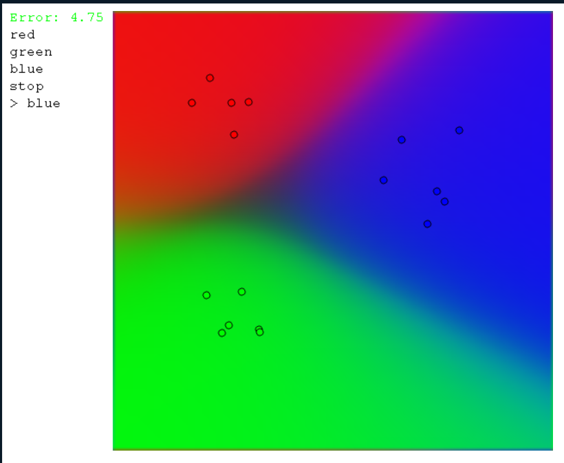

# 简单的神经网络

- repo: [Neural-network](https://github.com/Kofybrek/Neural-network)
- video: [Training my First NEURAL NETWORK in C++ and SFML - AI Tutorial](https://youtu.be/Zrrnqd0rCXg)

<iframe width="560" height="315" src="https://www.youtube.com/embed/Zrrnqd0rCXg" title="YouTube video player" frameborder="0" allow="accelerometer; autoplay; clipboard-write; encrypted-media; gyroscope; picture-in-picture" allowfullscreen></iframe>

## 运行

- 通过`Makefile`文件运行

  - `make`
  - `make run`

## C++源码

- `FRAME_DURATION` 和 `lag`是控制帧率的参数

  - `FRAME_DURATION`: 每帧的时间间隔, 单位是毫秒

    60 帧

## 展示

> start: 开始运行
>
> red : 设置为红色
>
> green : 设置为绿色
>
> blue : 设置为蓝色
>
> `>` : 提示当前颜色

### 效果

