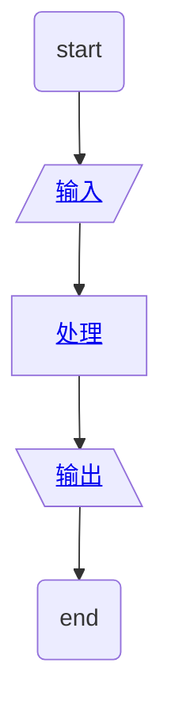
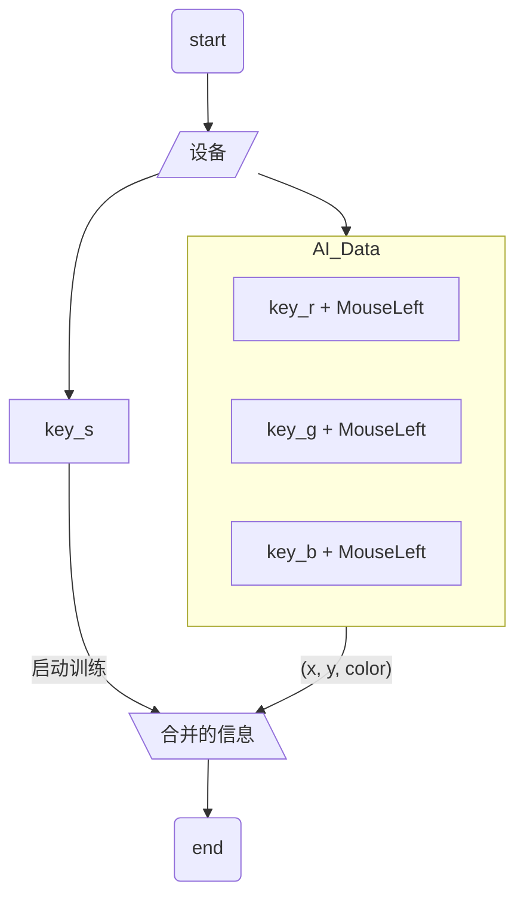
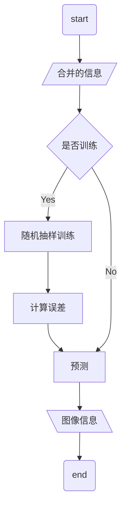
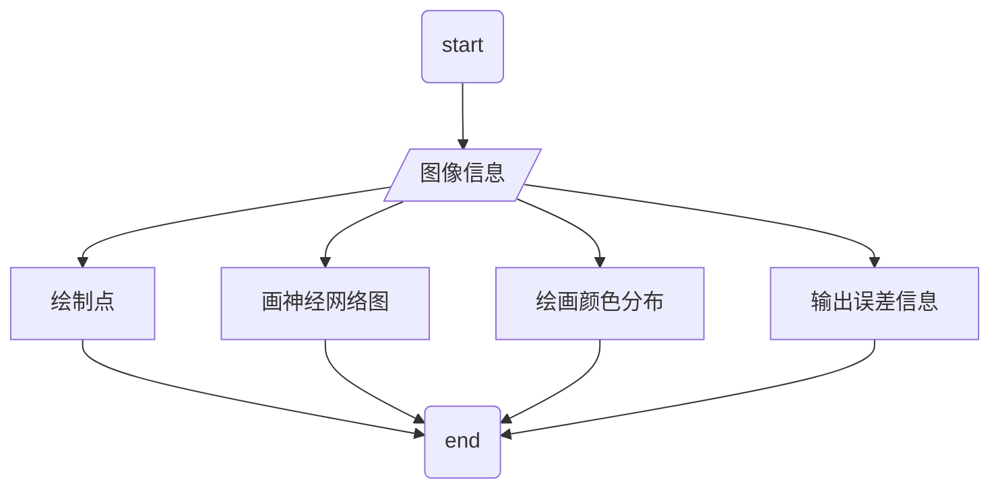

# 代码

## 教程

- video: [Training my First NEURAL NETWORK in C++ and SFML - AI Tutorial](https://youtu.be/Zrrnqd0rCXg)

<iframe width="560" height="315" src="https://www.youtube.com/embed/Zrrnqd0rCXg" title="YouTube video player" frameborder="0" allow="accelerometer; autoplay; clipboard-write; encrypted-media; gyroscope; picture-in-picture" allowfullscreen></iframe>

## 展示

## 代码主逻辑

- 输入: 鼠标, 键盘等
- 输出: 整个画面的颜色分布

### 输入

- 输入: 鼠标, 键盘等
- 输出: 代码信息

### 处理

- 输入: 合并的信息
- 输出: 图像信息

- 计算误差

  预测所有的样本值, 与真值比较, 得到误差

### 输出

- 输入: 图像信息
- 输出: 绘制图像

