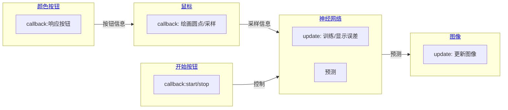

# 代码

## 教程

- video: [Training my First NEURAL NETWORK in C++ and SFML - AI Tutorial](https://youtu.be/Zrrnqd0rCXg)

<iframe width="560" height="315" src="https://www.youtube.com/embed/Zrrnqd0rCXg" title="YouTube video player" frameborder="0" allow="accelerometer; autoplay; clipboard-write; encrypted-media; gyroscope; picture-in-picture" allowfullscreen></iframe>

## 展示

## 代码主逻辑

> 采用面向`对象`的方法和`事件驱动`的模式

- 输入: 鼠标, 键盘等
- 输出: 整个画面的颜色分布

> `update`: 表示每帧都调用的
>
> `callback`: 对象有消息时响应

### 颜色按钮

### 开始按钮

### 鼠标

### 神经网络

### 图像

