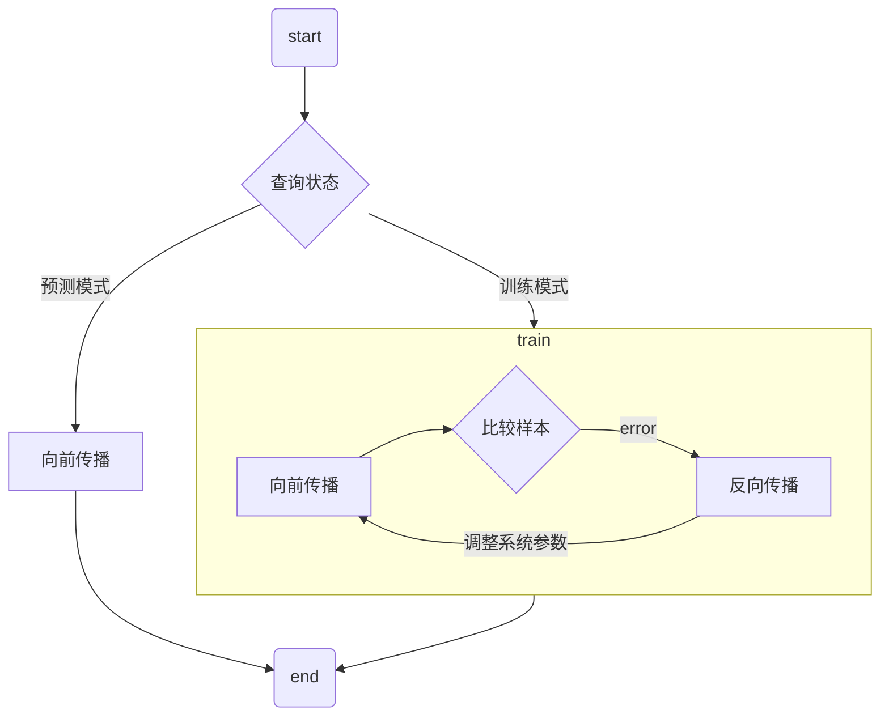
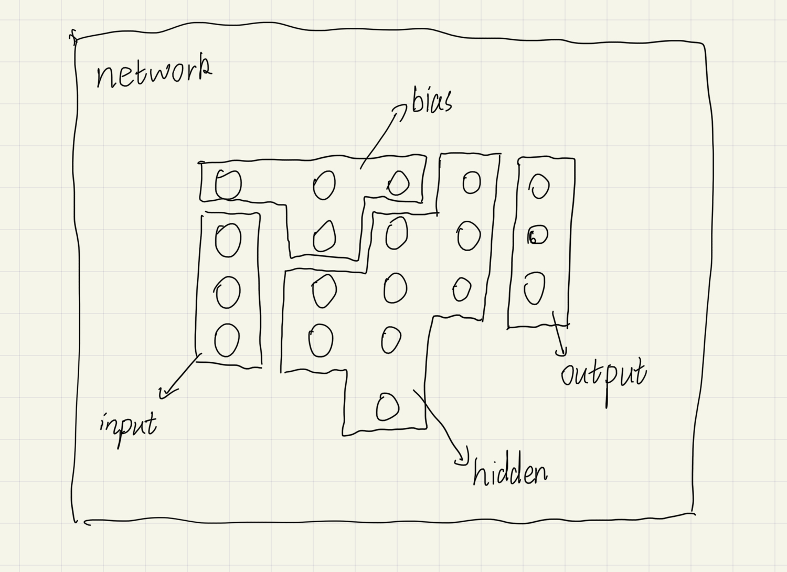
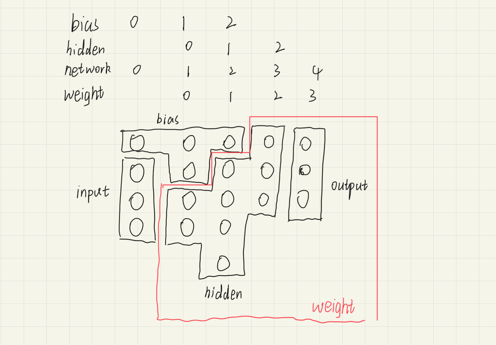
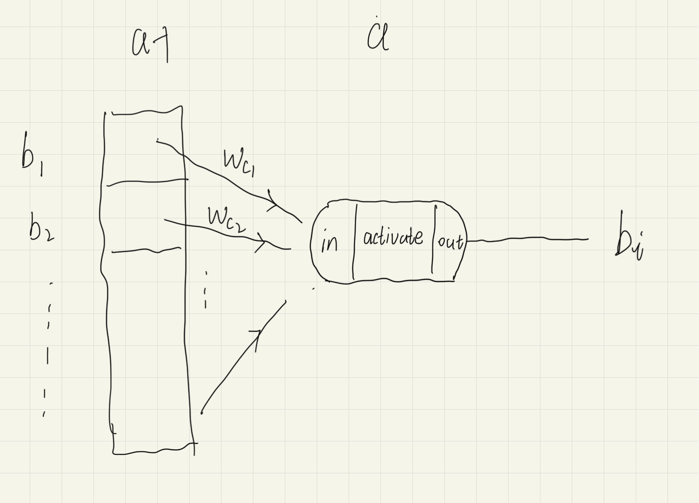

# 神经网络

## 基础知识

- [神经网络基础](https://www.cnblogs.com/maybe2030/p/5597716.html)

- [神经网络](https://www.ibm.com/cn-zh/cloud/learn/neural-networks)

- wiki: [人工神经网络](https://zh.wikipedia.org/wiki/%E4%BA%BA%E5%B7%A5%E7%A5%9E%E7%BB%8F%E7%BD%91%E7%BB%9C)

- wiki: [Artificial neural network](https://en.wikipedia.org/wiki/Artificial_neural_network)

- [一文弄懂神经网络中的反向传播法——BackPropagation](https://www.cnblogs.com/charlotte77/p/5629865.html)

  误差反向传播, 本质上是泰勒的链式传导

## 代码主逻辑

- 输入: `(x, y, color)`的集合
- 输出: 任意位置的颜色

  $$\{color=? \mid \forall x, y \in [0, 1]^2\}$$

### 向前传播

- 输入: `(x, y)`
- 输出: `color`

  分解为`(r, g, b)`

- 神经网络结构

  

- 坐标关系

  

- 单元神经结构

  

  $$
  \begin{aligned}
  in = \Sigma_k a_{(i-1, k)}\times \omega_{c_k}\\
  a_{ij} = out = f_{activate}(in)
  \end{aligned}
  $$

- 激活函数

### 反向传播
