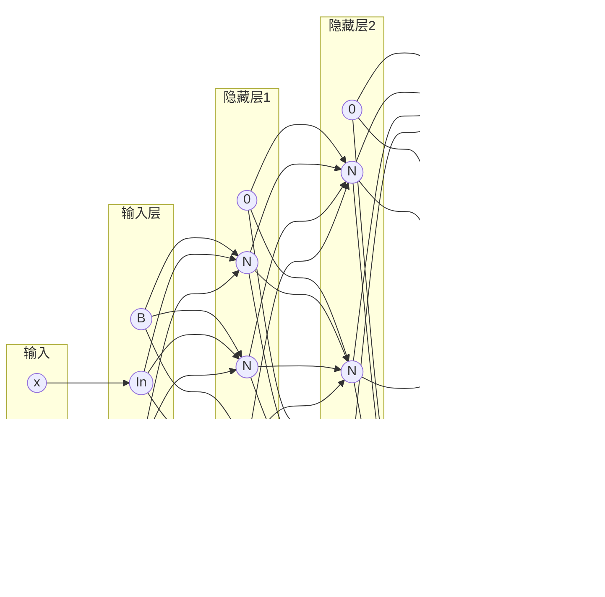

# 神经网络

## 基础知识

- [神经网络基础](https://www.cnblogs.com/maybe2030/p/5597716.html)

- [神经网络](https://www.ibm.com/cn-zh/cloud/learn/neural-networks)

- wiki: [人工神经网络](https://zh.wikipedia.org/wiki/%E4%BA%BA%E5%B7%A5%E7%A5%9E%E7%BB%8F%E7%BD%91%E7%BB%9C)

- wiki: [Artificial neural network](https://en.wikipedia.org/wiki/Artificial_neural_network)

## 结构

- 神经细胞(neuron: N)

  <!-- tabs:start -->

  #### **svg**

  ```mermaid
  flowchart LR
      subgraph Cell [神经细胞]
        direction LR

        input[/"输入: $\Sigma \omega_i x_i$"/]
        activate["激活函数: $f$"]
        output[\"输出: $y$"\]

        input --> activate --> output
      end

      connect(("连接节点: $x_i$"))

      connect -- "权重: $\omega_i$" --> input
  ```

  #### **image**

  

  <!-- tabs:end -->

- 输入层细胞(input: In)

  <!-- tabs:start -->

  #### **svg**

  ```mermaid
  flowchart LR
      subgraph Cell [输入层细胞]
        direction LR

        input[/"$x$"/]
        output[\"$x$"\]

        input  --> output
      end

      connect(("$x$"))

      connect  --> input
  ```

  #### **image**

  

  <!-- tabs:end -->

- 偏置细胞(bias: B)

  ```mermaid
  flowchart LR
      subgraph Cell [偏置细胞]
        direction LR

        input[/"1"/]
        output[\"1"\]

        input  --> output
      end
  ```

  若偏置细胞不存在, 则可以设置为

  ```mermaid
  flowchart LR
      subgraph Cell [偏置细胞]
        direction LR

        input[/"0"/]
        output[\"0"\]

        input  --> output
      end
  ```

### 网络结构



!> 0 为偏置细胞不存在

## 代码主逻辑

- 输入: `(x, y, color)`的集合
- 输出: 任意位置的颜色

  $$\{color=(r : ?, g : ?, b : ?) \mid \forall x, y \in [0, 1]^2\}$$


[](index.js ":include :type=code js")

> 训练采取随机选择样本的方式

### 初始化

#### network

> `network` 是整个结构, 每一层第一个都代表`偏置细胞`, 不存在偏置细胞则用`{input:0, output:0}`代替

[](InitNetwork/InitNetwork.js ":include :type=code js")

#### weights

> `weights` 为每个`N`细胞对前面一层细胞的连接

可以看出:

- 每层索引关系

  偏离一个输出层

  $$
  iNetwork = iWeight + 1
  $$

- 每行细胞的位置关系

  由于存在一个偏置细胞

  $$
  jNetwork = jWeight + 1
  $$

[](InitNetwork/InitWeight.js ":include :type=code js")

#### error

> `error` 为每个`N`细胞产生的误差

- 位置关系

  $$
  iError = iWeight\\
  jError = jWeight
  $$

[](InitNetwork/InitErrors.js ":include :type=code js")

### 向前传播

<!-- tabs:start -->

#### **svg**


#### **image**


<!-- tabs:end -->

$$
\begin{aligned}
in_i &= \Sigma_j (\omega_{(i-1, j)} \cdot out_{(i-1, j)}) + b\\
&= \Sigma_k (\omega_{(i-1, j)} \cdot out_{(i-1, j)}) + \omega_{(i, 0)} \times 1
\end{aligned}
$$

$$
out_i = f_{activate}(in_i)
$$

[](ForwardPropagation.js ":include :type=code js")

#### 激活函数

$$
f(x) = \begin{cases}
  1 - 2^{-|x|-1} & \text{if} \ x > 0 \\
  2^{-|x|-1} & \text{if} \ x \leq 0
\end{cases}
$$

<!-- tabs:start -->

#### **svg**

<iframe src="https://www.desmos.com/calculator/dzudwuc28e?embed" width="500" height="500" style="border: 1px solid #ccc" frameborder=0></iframe>

#### **image**


<!-- tabs:end -->

$$
f^{\prime}(x) = \ln 2 \times 2^{-|x|-1}
$$

[](ActivationFunction.js ":include :type=code js")

### 评估

$$
E_{total} = \frac {1} {4} \Sigma (y_{predict} - y_{sample})^4
$$

[](ErrorFunction.js ":include :type=code js")

### 反向传播

- [一文弄懂神经网络中的反向传播法——BackPropagation](https://www.cnblogs.com/charlotte77/p/5629865.html)

  误差反向传播, 本质上是泰勒的链式传导

<!-- tabs:start -->

#### **svg**


#### **image**


<!-- tabs:end -->

- Weight

  $$
  \omega_i^{\prime} = \omega_i - \eta \cdot \frac {\partial E_{total}} {\partial \omega_i}
  $$

  $$
  \begin {aligned}
  \frac {\partial E_{total}} {\partial \omega_i} &= \frac {\partial E_{total}} {\partial out_i} \cdot \frac {\partial out_i} {\partial in_i} \cdot \frac {\partial in_i} {\partial \omega_i} \\
  &= Error_i \cdot f^{\prime}(in_i) \cdot out_{i-1}
  \end {aligned}
  $$

- Error

  $$
  Error_i = \frac {\partial E_{total}} {\partial out_i}
  $$

  - 最后一层 Error 的初始化

    $$
    \begin {aligned}
    Error &= \frac {\partial E_{total}} {\partial out}\\
    &= \frac {\partial E_{total}} {\partial y_{predict}}\\
    &= (y_{predict} - y_{sample})^3
    \end{aligned}
    $$

  - 递推

    > 利用`全微分`的叠加性

    $$
    \begin {aligned}
    Error_{i-1} &= \frac{\partial E_{total}} {\partial out_{i-1}}\\
    &= \Sigma_j (\frac{\partial E_{total}} {\partial out_{(i, j)}} \cdot \frac{\partial out_{(i, j)}} {\partial out_{i-1}} )\\
    &= \Sigma_j (\frac{\partial E_{total}} {\partial out_{(i, j)}} \cdot \frac{\partial out_{(i, j)}} {\partial in_{(i, j)}} \cdot \frac{\partial in_{(i, j)}} {\partial out_{i-1}} )\\
    &= \Sigma_j (Error_i \cdot f^{\prime}(in_{(i,j)}) \cdot \omega_{i-1} )\\
    \end {aligned}
    $$

[](BackPropagation.js ":include :type=code js")
